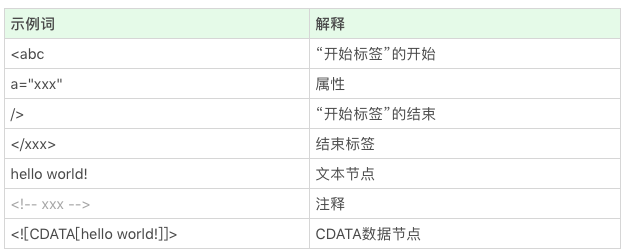

# 浏览器：一个浏览器是如何工作的？（阶段二）


你好，我是 winter，今天我们继续来看浏览器的相关内容。

我在上一篇文章中，简要介绍了浏览器的工作大致可以分为 6 个阶段，我们昨天讲完了第一个阶段，也就是通讯的部分：浏览器使用 HTTP 协议或者 HTTPS 协议，向服务端请求页面的过程。

今天我们主要来看两个过程：如何解析请求回来的 HTML 代码，DOM 树又是如何构建的。


## 解析代码

我们在前面讲到了 HTTP 的构成，但是我们有一部分没有详细讲解，那就是 Response 的 body 部分，这正是因为 HTTP 的 Response 的 body，就要交给我们今天学习的内容去处理了。

HTML 的结构不算太复杂，我们日常开发需要的 90% 的“词”（指编译原理的术语 token，表示最小的有意义的单元），种类大约只有标签开始、属性、标签结束、注释、CDATA 节点几种。

实际上有点麻烦的是，由于 HTML 跟 SGML 的千丝万缕的联系，我们需要做不少容错处理。`<?`和`<%`什么的也是必须要支持好的，报了错也不能吭声。

### 1. 词（token）是如何被拆分的

首先我们来看看一个非常标准的标签，会被如何拆分：

```javascript
<p class="a">text text text</p>
```

如果我们从最小有意义单元的定义来拆分，第一个词（token）是什么呢？显然，作为一个词（token），整个 p 标签肯定是过大了（它甚至可以嵌套）。

那么，只用 p 标签的开头是不是合适吗？我们考虑到起始标签也是会包含属性的，最小的意义单元其实是`<p`  ，所以`<p` 就是我们的第一个词（token）。我们继续拆分，可以把这段代码依次拆成词（token）：

* `<p`“标签开始”的开始；
* `class=“a”` 属性；
* `>` “标签开始”的结束；
* `text text text` 文本；
* `</p>` 标签结束。

这是一段最简单的例子，类似的还有什么呢？现在我们可以来来看看这些词（token）长成啥样子：



根据这样的分析，现在我们讲讲浏览器是如何用代码实现，我们设想，代码开始从 HTTP 协议收到的字符流读取字符。

在接受第一个字符之前，我们完全无法判断这是哪一个词（token），不过，随着我们接受的字符越来越多，拼出其他的内容可能性就越来越少。

比如，假设我们接受了一个字符 `< ` 我们一下子就知道这不是一个文本节点啦。

之后我们再读一个字符，比如就是 x，那么我们一下子就知道这不是注释和 CDATA 了，接下来我们就一直读，直到遇到“>”或者空格，这样就得到了一个完整的词（token）了。

实际上，我们每读入一个字符，其实都要做一次决策，而且这些决定是跟“当前状态”有关的。在这样的条件下，浏览器工程师要想实现把字符流解析成词（token），最常见的方案就是使用状态机。

### **2. 状态机**

绝大多数语言的词法部分都是用状态机实现的。那么我们来把部分词（token）的解析画成一个状态机看看：


当然了，我们这里的分析比较粗略，真正完整的 HTML 词法状态机，比我们描述的要复杂的多。更详细的内容，你可以参考[HTML 官方文档](https://html.spec.whatwg.org/multipage/parsing.html#tokenization)，HTML 官方文档规定了 80 个状态（顺便一说，HTML 是我见过唯一一个标准中规定了状态机实现的语言，对大部分语言来说，状态机是一种实现而非定义）。

这里我们为了理解原理，用这个简单的状态机就足够说明问题了。

状态机的初始状态，我们仅仅区分  `< `和  `非 < `：

如果获得的是一个非  `<  `字符，那么可以认为进入了一个文本节点；如果获得的是一个 ` <  `字符，那么进入一个标签状态。

不过当我们在标签状态时，则会面临着一些可能性。

比如下一个字符是 ` !  ` ，那么很可能是进入了注释节点或者 CDATA 节点。如果下一个字符是  `/  `，那么可以确定进入了一个结束标签。如果下一个字符是字母，那么可以确定进入了一个开始标签。如果我们要完整处理各种 HTML 标准中定义的东西，那么还要考虑 `?  ` `%  `等内容。

我们可以看到，用状态机做词法分析，其实正是把每个词的“特征字符”逐个拆开成独立状态，然后再把所有词的特征字符链合并起来，形成一个联通图结构。

由于状态机设计属于编译原理的基本知识，这里我们仅作一个简要的介绍。

接下来就是代码实现的事情了，在 C/C++ 和 JavaScript 中，实现状态机的方式大同小异：我们把每个函数当做一个状态，参数是接受的字符，返回值是下一个状态函数。（这里我希望再次强调下，状态机真的是一种没有办法封装的东西，所以我们永远不要试图封装状态机。）

为了方便理解和试验，我们这里用 JavaScript 来讲解，图上的 data 状态大概就像下面这样的：

```javascript
var data = function(c){
    if(c=="&") {
        return characterReferenceInData;
    }
    if(c=="<") {
        return tagOpen;
    }
    else if(c=="\0") {
        error();
        emitToken(c);
        return data;
    }
    else if(c==EOF) {
        emitToken(EOF);
        return data;
    }
    else {
        emitToken(c);
        return data;
    }
};
var tagOpenState = function tagOpenState(c){
    if(c=="/") {
        return endTagOpenState;
    }
    if(c.match(/[A-Z]/)) {
        token = new StartTagToken();
        token.name = c.toLowerCase();
        return tagNameState;
    }
    if(c.match(/[a-z]/)) {
        token = new StartTagToken();
        token.name = c;
        return tagNameState;
    }
    if(c=="?") {
        return bogusCommentState;
    }
    else {
        error();
        return dataState;
    }
};
//……
```

这段代码给出了状态机的两个状态示例：data 即为初始状态，tagOpenState 是接受了一个“ < ” 字符，来判断标签类型的状态。

这里的状态机，每一个状态是一个函数，通过“if else”来区分下一个字符做状态迁移。这里所谓的状态迁移，就是当前状态函数返回下一个状态函数。

这样，我们的状态迁移代码非常的简单：

```javascript
var state = data;
var char
while(char = getInput())
    state = state(char);
```

这段代码的关键一句是“ state = state(char) ”，不论我们用何种方式来读取字符串流，我们都可以通过 state 来处理输入的字符流，这里用循环是一个示例，真实场景中，可能是来自 TCP 的输出流。

状态函数通过代码中的 emitToken 函数来输出解析好的 token（词），我们只需要覆盖 emitToken，即可指定对解析结果的处理方式。

词法分析器接受字符的方式很简单，就像下面这样：

```javascript
function HTMLLexicalParser(){

    //状态函数们……
    function data() {
        // ……
    }

    function tagOpen() {
        // ……
    }
    // ……
    var state = data;
    this.receiveInput = function(char) {
        state = state(char);
    }
}
```

至此，我们就把字符流拆成了词（token）了。

## 构建 DOM 树

接下来我们要把这些简单的词变成 DOM 树，这个过程我们是使用栈来实现的，任何语言几乎都有栈，为了给你跑着玩，我们还是用 JavaScript 来实现吧，毕竟 JavaScript 中的栈只要用数组就好了。

```javascript
function HTMLSyntaticalParser(){
    var stack = [new HTMLDocument];
    this.receiveInput = function(token) {
        //……
    }
    this.getOutput = function(){
        return stack[0];
    }
}

```

我们这样来设计 HTML 的语法分析器，receiveInput 负责接收词法部分产生的词（token），通常可以由 emitToken 来调用。

在接收的同时，即开始构建 DOM 树，所以我们的主要构建 DOM 树的算法，就写在 receiveInput 当中。当接收完所有输入，栈顶就是最后的根节点，我们 DOM 树的产出，就是这个 stack 的第一项。

为了构建 DOM 树，我们需要一个 Node 类，接下来我们所有的节点都会是这个 Node 类的实例。

在完全符合标准的浏览器中，不一样的 HTML 节点对应了不同的 Node 的子类，我们为了简化，就不完整实现这个继承体系了。我们仅仅把 Node 分为 Element 和 Text（如果是基于类的 OOP 的话，我们还需要抽象工厂来创建对象），

```javascript
function Element(){
    this.childNodes = [];
}
function Text(value){
    this.value = value || "";
}
```

前面我们的词（token）中，以下两个是需要成对匹配的：

* tag start
* tag end

根据一些编译原理中常见的技巧，我们使用的栈正是用于匹配开始和结束标签的方案。

对于 Text 节点，我们则需要把相邻的 Text 节点合并起来，我们的做法是当词（token）入栈时，检查栈顶是否是 Text 节点，如果是的话就合并 Text 节点。

同样我们来看看直观的解析过程：

```javascript
<html maaa=a >
    <head>
        <title>cool</title>
    </head>
    <body>
        
    </body>
</html>
```

通过这个栈，我们可以构建 DOM 树：

* 栈顶元素就是当前节点；
* 遇到属性，就添加到当前节点；
* 遇到文本节点，如果当前节点是文本节点，则跟文本节点合并，否则入栈成为当前节点的子节点；
* 遇到注释节点，作为当前节点的子节点；
* 遇到 tag start 就入栈一个节点，当前节点就是这个节点的父节点；遇到 tag end 就出栈一个节点（还可以检查是否匹配）。

当我们的源代码完全遵循 XHTML（这是一种比较严谨的 HTML 语法）时，这非常简单问题，然而 HTML 具有很强的容错能力，奥妙在于当 tag end 跟栈顶的 start tag 不匹配的时候如何处理。

于是，这又有一个极其复杂的规则，幸好 W3C 又一次很贴心地把全部规则都整理地很好，我们只要翻译成对应的代码就好了，以下这个网站呈现了全部规则。你可以点击查看。

http://www.w3.org/html/wg/drafts/html/master/syntax.html#tree-construction

## 结语

好了，总结一下。在今天的文章中，我带你继续探索了浏览器的工作原理，我们主要研究了解析代码和构建 DOM 树两个步骤。在解析代码的环节里，我们一起详细地分析了一个词（token）被拆分的过程，并且给出了实现它所需要的一个简单的状态机。

在构建 DOM 树的环节中，基本思路是使用栈来构建 DOM 树为了方便你动手实践，我用 JavaScript 实现了这一过程。

今天给你留的题目是：在语法和词法的代码，我已经给出了大体的结构，请你试着把内容补充完整吧。