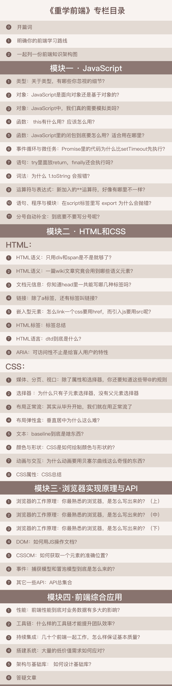

# 专栏介绍

## 你将获得

- 告别零散技术点，搭建前端知识体系；
- 打通JS、HTML、CSS、浏览器4大脉络；
- 40+前端难点完全解答；
- 大厂前端工程实战演练。

## 讲师介绍

程劭非，网名“winter”，前端社区知名专家，前手机淘宝前端负责人，先后就职于微软、盛大、阿里巴巴等公司。winter早年做过嵌入式系统浏览器、电子书和 WebOS的相关工作，近年致力于移动前端领域研究，提出过 Flexible 布局等先进概念，也产出过 Weex这样的移动前端开发框架。

## 课程介绍

随着前端技术不断地发展，岗位需求与薪资一路攀升。整个前端业界正值“黄金时代”，而前端开发者们却似乎“学不动了”。

这缘于前端的学习是一条先快后慢的曲线。在快速入门之后，大多数人都会感觉：自己仅仅停留在会用的阶段，后面的学习之路似乎越来越陡峭，每前进一步都十分艰难。

其实是你没有意识到，你在自学的过程中走了太多弯路。

大部分前端工程师的知识，其实都来自于工作中零散的学习和实践。在这种情况下，学习方向一旦偏离，就可能导致基础不牢固，知识认知不清晰，难以建立完整的知识体系。

并且，如果所在公司业务简单，工程师更难以在实践中形成技术积累，这导致了自身技术长期处于非常初级的阶段。

winter在手机淘宝一直负责前端工程师的面试与培养工作，他深知其中的痛点与难点。在这个专栏中，winter将带你告别零散和盲目的自学，重新学习前端，一起搭建前端知识框架，共同明确学习重点，精进前端技术。

### **专栏分为4大模块。**

### **模块一，JavaScript** 

这部分会按照文法、语义和运行时去讨论JavaScript语言。这样的划分符合编程语言的一般规律，即“用一定的词法和语法，表达一定语义，去操作运行时”。而且，这样的划分也整合了零散的知识点，具有完备性。

### **模块二，HTML5和CSS3**

这部分重点介绍HTM5和CSS3的使用。

### **模块三，浏览器实现原理与API**

这部分会着重讲解浏览器的工作原理。我们会一起来了解：一个浏览器到底是如何工作的。并且，我们还会学习一些重要的浏览器API，包括BOM、DOM、CSSOM等内容。只有了解了这些知识，你才能把JavaScript和HTML、CSS联系起来实现具体功能。

### **模块四，前端综合应用**

作者会结合自己的前端工作经验，选择自己在手淘和淘宝工作中的一些案例来辅助讲解前端的性能、工具链、持续集成、架构等实际应用内容。

## 课程目录

